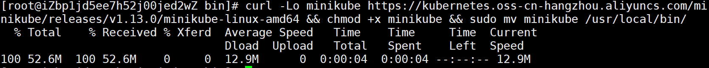
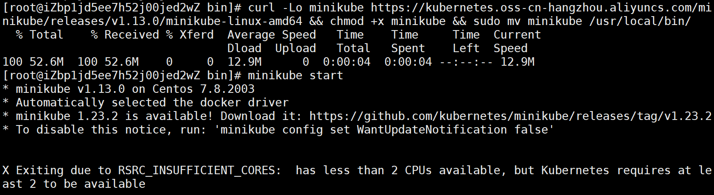
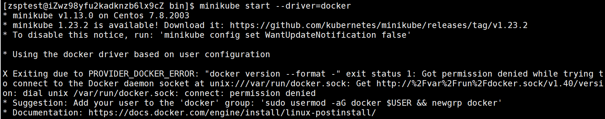
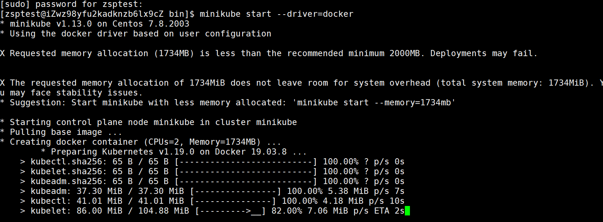
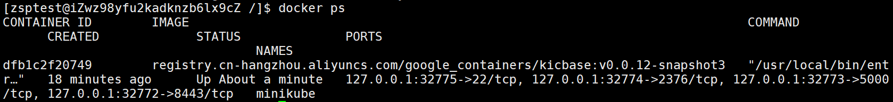
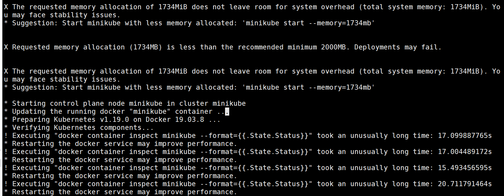
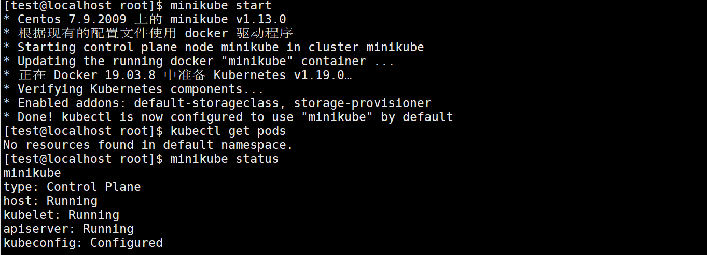
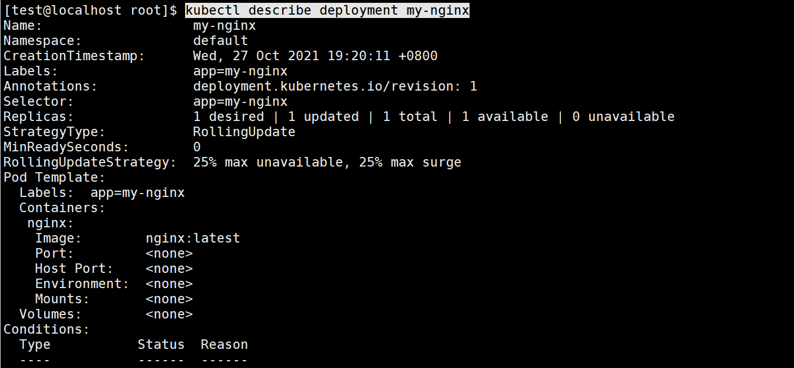

# Kubernetes

## 概述

* Kubernetes又称作k8s，是Google在2014年发布的一个开源项目。（大厂背书）
* 最初Google开发了一个叫Borg的系统(现在命名为Omega)，来调度近20多亿个容器。在积累了数十年的经验后，Google决定重写这个容器管理系统，并贡献给开源社区，而这个系统就是Kubernetes。它也是Omega的开源版本。（量大）
* 从2014年第一个版本发布l来，迅速得到了开源社区的追捧，目前，k&s已经成为了发展最快、市场占有率最高的容器编排引擎产品。（时间长）
* Kubernetes中文社区|中文文档：https://www.kubernetes.org.cn/k8s

云原生：k8s+configmap（配置中心，支持热加载）+etcd（存储配置、状态的发现中心）+servicemesh（网格服务）+CI/CD

servicemesh：由若干个SideCar组成，sidecar类似一个边三轮（抗日剧中的摩托车旁边带小坐车的那种）。其副座的作用是部署sidecar proxy，该 sidecar proxy 负责接管对应服务的入流量和出流量。并将微服务架构中以前有公共库、framework实现的熔断、限流、降级、服务发现、调用链分布式跟踪以及立体监控等功能从服务中抽离到该 proxy 中。（中小公司玩不起来）

CI/CD：将服务部署分为多个模块，自动将其模块按其依赖进行部署。不用再人工等待其他依赖组部署完毕后再进行模块部署。

## 安装k8s

* 设置阿里镜像，并且安装k8s

```shell
export REGISTRY_MIRROR=https://registry.cn-hangzhou.aliyuncs.com
curl -sSL https://kuboard.cn/install-script/v1.19.x/install_kubelet.sh | sh -s 1.19.2
```

## 安装minikube

* 使用命令下载minikube

```shell
curl -Lo minikube https://kubernetes.oss-cn-hangzhou.aliyuncs.com/minikube/releases/v1.13.0/minikube-linux-amd64 && chmod +x minikube && sudo mv minikube /usr/local/bin/
```



* 使用命令启动minikube，准备面对一堆bug吧！

```shell
minikube start
```

* 第一个bug：cpu核心不足2核，虚拟机就调高点cpu核心，云服务器就换一台，没有其他办法。

```shell
X Exiting due to RSRC_INSUFFICIENT_CORES:  has less than 2 CPUs available, but Kubernetes requires at least 2 to be available
```



* 第二个bug：马上买了一台新2g云服务器，再报第二个bug，这个bug是告诉你，你不能使用root用户启动，所以我们创建一个用户出来。

```
adduser test
passwd test
```

* 第三个bug：用户权限不在docker的权限组

```shell
X Exiting due to PROVIDER_DOCKER_ERROR: "docker version --format -" exit status 1: Got permission denied while trying to connect to the Docker daemon socket at unix:///var/run/docker.sock: Get http://%2Fvar%2Frun%2Fdocker.sock/v1.40/version: dial unix /var/run/docker.sock: connect: permission denied

```



```shell
#创建docker组
sudo groupadd docker
#将您的用户添加到该docker组
sudo usermod -aG docker $USER
#在Linux上，运行以下命令来激活对组的更改
newgrp docker
```

* 第四个bug：云服务器能存小于2g，准备买第三台服务器的时候看到，可以限制内存运行大小，于是乎就算了。

```shell
X Requested memory allocation (1734MB) is less than the recommended minimum 2000MB. Deployments may fail.

X The requested memory allocation of 1734MiB does not leave room for system overhead (total system memory: 1734MiB). You may face stability issues.
```



再次使用安装命令，至此，minikube安装完毕！

```
minikube start --driver=docker
```



* 第五个bug：并没有完，我的网站和数据库被这个的东西炸了，然而还是没启动好。看了下原因，它想让我重启我的docker容器。

```shell
X The requested memory allocation of 1734MiB does not leave room for system overhead (total system memory: 1734MiB). You may face stability issues.
* Suggestion: Start minikube with less memory allocated: 'minikube start --memory=1734mb'

* Starting control plane node minikube in cluster minikube
* Updating the running docker "minikube" container ...
* Preparing Kubernetes v1.19.0 on Docker 19.03.8 ...
* Verifying Kubernetes components...
! Executing "docker container inspect minikube --format={{.State.Status}}" took an unusually long time: 17.099887765s
* Restarting the docker service may improve performance.
! Executing "docker container inspect minikube --format={{.State.Status}}" took an unusually long time: 17.004489172s
* Restarting the docker service may improve performance.

```



使用命令关闭minikube，然后切换用户到root，关闭docker，切回用户再次开启docker，然后再次启动。

```shell
[zsptest@iZwz98yfu2kadknzb6lx9cZ test]$ 
[zsptest@iZwz98yfu2kadknzb6lx9cZ test]$ su
Password: 
[root@iZwz98yfu2kadknzb6lx9cZ test]# systemctl stop docker
[root@iZwz98yfu2kadknzb6lx9cZ test]# su zsptest
[zsptest@iZwz98yfu2kadknzb6lx9cZ test]$ systemctl start docker
==== AUTHENTICATING FOR org.freedesktop.systemd1.manage-units ===
Authentication is required to manage system services or units.
Authenticating as: root
Password: 
==== AUTHENTICATION COMPLETE ===
[zsptest@iZwz98yfu2kadknzb6lx9cZ test]$ docker ps
CONTAINER ID        IMAGE               COMMAND             CREATED             STATUS              PORTS               NAMES
[zsptest@iZwz98yfu2kadknzb6lx9cZ test]$ minikube start --driver=docker --memory=1734mb

```

再次启动，成功！说明一切就绪，可以开始玩k8s了！



## 基本命令

* 查看结点

```shell
[test@localhost root]$ kubectl get nodes
NAME       STATUS   ROLES    AGE   VERSION
minikube   Ready    master   18m   v1.19.0
```

 【解释】

```shell
node是用于承载运行中的容器的
有一个node，这个node的角色是master
k8s也有集群的概念，即：cluster，包含master和node，该节点就是master节点，也是node节点。
```

* 创建nginx的deployment

```shell
[test@localhost root]$ kubectl create deployment my-nginx --image nginx:latest 
    
deployment.apps/my-nginx created
```

【解释】

```shell
创建deployment其实有两种方式
1>基于命令行配置运行
 kubectl create
 kubectl create deployment my-nginx --image nginx:latest
 
 kubectl run
2>基于yaml配置文件的
 kubectl apply -f xxx.yml
 
 [test@localhost ~]$ kubectl create -f nginx-deployment.yaml
```

* 查看所有pod信息以及ip和port（想看更多信息就 -o wide）这个ip是可以ping通的：

```shell
 [test@localhost root]$ kubectl get pods
NAME                       READY   STATUS    RESTARTS   AGE
my-nginx-b7d7bc74d-447rv   1/1     Running   0          66m

[test@localhost root]$ kubectl get pods -o wide
NAME                       READY   STATUS    RESTARTS   AGE   IP           NODE       NOMINATED NODE   READINESS GATES
my-nginx-b7d7bc74d-447rv   1/1     Running   0          38m   172.18.0.3   minikube   <none>           <none>
```

* 查看所有service

```shell
[test@localhost root]$ kubectl get service
NAME         TYPE        CLUSTER-IP   EXTERNAL-IP   PORT(S)   AGE
kubernetes   ClusterIP   10.96.0.1    <none>        443/TCP   3h1m
```

* 查看所有的deploys

```shell
kubectl get deploys
```

【解释】

```shell
pod是不稳定的，服务可以保证稳定。
双十一之前，订单系统需要20个服务实例，双十一促销阶段，扩容至100个服务实例。双一之后，对服务缩容至30个服务实例。
我们是一个稳定的请求方式，统一个ip的,这个就是service的作用。
```

* 查询所有命名空间

```shell
[test@localhost root]$ kubectl get namespace
NAME              STATUS   AGE
default           Active   3h18m
kube-node-lease   Active   3h18m
kube-public       Active   3h18m
kube-system       Active   3h18m
```

【解释】

```
默认是default
其他kube-*的都是k8s系统自己的命名空间。
```

查看默认命名空间：可以看到默认的命名空间是default

```
kubectl describe deployment my-nginx
```



* 将副本数从1个修改为3个：设置完毕后查看pods，发现多了两个副本，查看deploy发现有三个就绪

```shell
[test@localhost root]$ kubectl scale deployments/my-nginx --replicas=3
deployment.apps/my-nginx scaled

[test@localhost root]$ kubectl get pods
NAME                       READY   STATUS    RESTARTS   AGE
my-nginx-b7d7bc74d-447rv   1/1     Running   0          3h17m
my-nginx-b7d7bc74d-f5vcl   1/1     Running   0          63s
my-nginx-b7d7bc74d-qlpv4   1/1     Running   0          63s

[test@localhost root]$ kubectl get pods -o wide
NAME                       READY   STATUS    RESTARTS   AGE     IP           NODE       NOMINATED NODE   READINESS GATES
my-nginx-b7d7bc74d-447rv   1/1     Running   0          3h23m   172.18.0.3   minikube   <none>           <none>
my-nginx-b7d7bc74d-f5vcl   1/1     Running   0          6m45s   172.18.0.5   minikube   <none>           <none>
my-nginx-b7d7bc74d-qlpv4   1/1     Running   0          6m45s   172.18.0.4   minikube   <none>           <none>

[test@localhost root]$ kubectl get deploy
NAME       READY   UP-TO-DATE   AVAILABLE   AGE
my-nginx   3/3     3            3           3h21m
```

【解释】

>* 什么是副本个数？
>
>  pod个数
>
>* 如果我们不指定副本个数的话，那么默认就是一个pod

* 将副本数从3个变成2个

```shell
[test@localhost ~]$ kubectl scale deployments/my-nginx --replicas=2
deployment.apps/my-nginx scaled

[test@localhost ~]$ kubectl get deploy
NAME               READY   UP-TO-DATE   AVAILABLE   AGE
my-nginx           2/2     2            2           20h
nginx-deployment   2/2     2            2           4h44m

[test@localhost ~]$ kubectl scale deployments/nginx-deployment --replicas=0
deployment.apps/nginx-deployment scaled

[test@localhost ~]$ kubectl get deploy
NAME               READY   UP-TO-DATE   AVAILABLE   AGE
my-nginx           2/2     2            2           20h
nginx-deployment   0/0     0            0           4h44m

```

## 重要概念

### cluster

>​	资源的集合。我们的k8s利用这些资源运行各种基于容器的应用。

### Master

>Cluster的大脑。司令部。主要的任务就是用来调度的。决定我们的应用应该放到哪里去执行。
>
>为了高可用，也可以	
