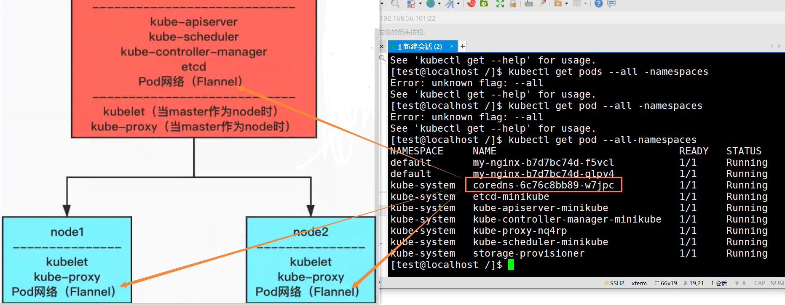
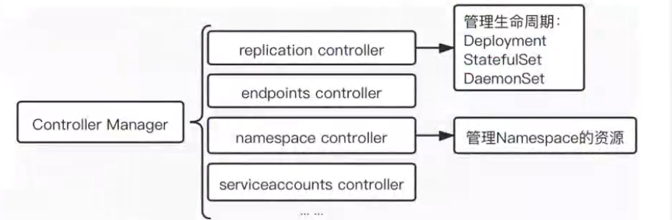
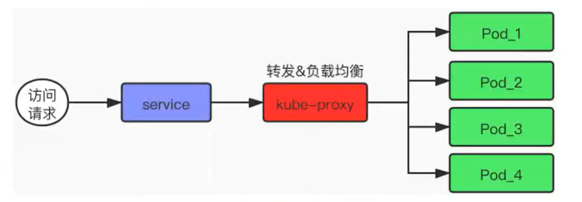
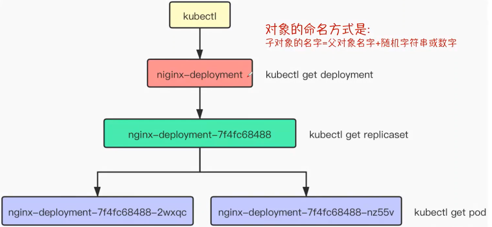
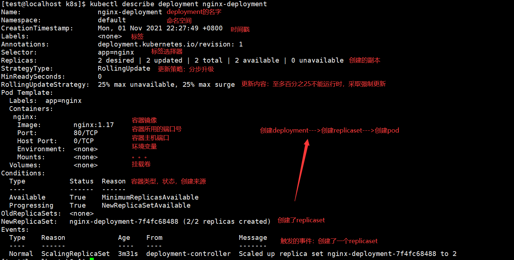
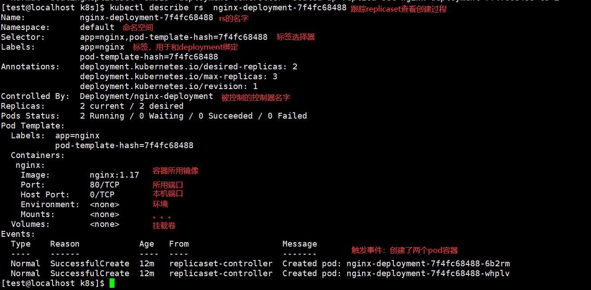
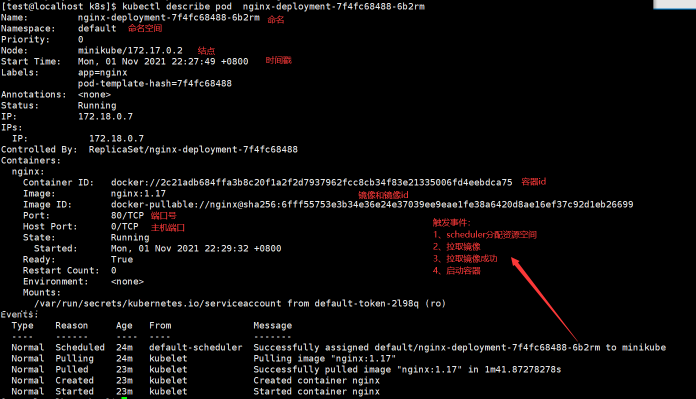
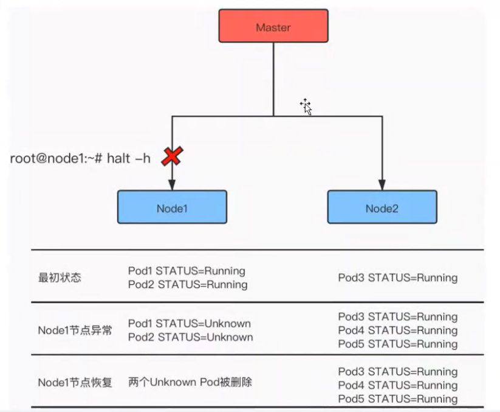
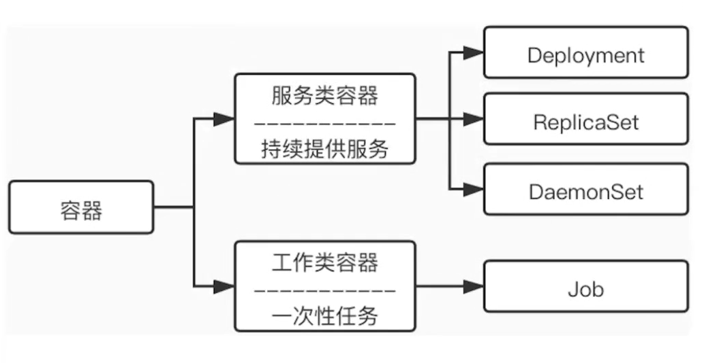

# Kubernetes

## 概述

* Kubernetes又称作k8s，是Google在2014年发布的一个开源项目。（大厂背书）
* 最初Google开发了一个叫Borg的系统(现在命名为Omega)，来调度近20多亿个容器。在积累了数十年的经验后，Google决定重写这个容器管理系统，并贡献给开源社区，而这个系统就是Kubernetes。它也是Omega的开源版本。（量大）
* 从2014年第一个版本发布l来，迅速得到了开源社区的追捧，目前，k&s已经成为了发展最快、市场占有率最高的容器编排引擎产品。（时间长）
* Kubernetes中文社区|中文文档：https://www.kubernetes.org.cn/k8s

云原生：k8s+configmap（配置中心，支持热加载）+etcd（存储配置、状态的发现中心）+servicemesh（网格服务）+CI/CD

servicemesh：由若干个SideCar组成，sidecar类似一个边三轮（抗日剧中的摩托车旁边带小坐车的那种）。其副座的作用是部署sidecar proxy，该 sidecar proxy 负责接管对应服务的入流量和出流量。并将微服务架构中以前有公共库、framework实现的熔断、限流、降级、服务发现、调用链分布式跟踪以及立体监控等功能从服务中抽离到该 proxy 中。（中小公司玩不起来）

CI/CD：将服务部署分为多个模块，自动将其模块按其依赖进行部署。不用再人工等待其他依赖组部署完毕后再进行模块部署。

## 安装k8s

* 设置阿里镜像，并且安装k8s

```shell
export REGISTRY_MIRROR=https://registry.cn-hangzhou.aliyuncs.com
curl -sSL https://kuboard.cn/install-script/v1.19.x/install_kubelet.sh | sh -s 1.19.2
```

## 安装minikube

* 使用命令下载minikube

```shell
curl -Lo minikube https://kubernetes.oss-cn-hangzhou.aliyuncs.com/minikube/releases/v1.13.0/minikube-linux-amd64 && chmod +x minikube && sudo mv minikube /usr/local/bin/
```


* 使用命令启动minikube，准备面对一堆bug吧！

```shell
minikube start
```

* 第一个bug：cpu核心不足2核，虚拟机就调高点cpu核心，云服务器就换一台，没有其他办法。

```shell
X Exiting due to RSRC_INSUFFICIENT_CORES:  has less than 2 CPUs available, but Kubernetes requires at least 2 to be available
```


* 第二个bug：马上买了一台新2g云服务器，再报第二个bug，这个bug是告诉你，你不能使用root用户启动，所以我们创建一个用户出来。

```
adduser test
passwd test
```

* 第三个bug：用户权限不在docker的权限组

```shell
X Exiting due to PROVIDER_DOCKER_ERROR: "docker version --format -" exit status 1: Got permission denied while trying to connect to the Docker daemon socket at unix:///var/run/docker.sock: Get http://%2Fvar%2Frun%2Fdocker.sock/v1.40/version: dial unix /var/run/docker.sock: connect: permission denied

```


```shell
#创建docker组
sudo groupadd docker
#将您的用户添加到该docker组
sudo usermod -aG docker $USER
#在Linux上，运行以下命令来激活对组的更改
newgrp docker
```

* 第四个bug：云服务器能存小于2g，准备买第三台服务器的时候看到，可以限制内存运行大小，于是乎就算了。

```shell
X Requested memory allocation (1734MB) is less than the recommended minimum 2000MB. Deployments may fail.

X The requested memory allocation of 1734MiB does not leave room for system overhead (total system memory: 1734MiB). You may face stability issues.
```


再次使用安装命令，至此，minikube安装完毕！

```
minikube start --driver=docker
```


* 第五个bug：并没有完，我的网站和数据库被这个的东西炸了，然而还是没启动好。看了下原因，它想让我重启我的docker容器。

```shell
X The requested memory allocation of 1734MiB does not leave room for system overhead (total system memory: 1734MiB). You may face stability issues.
* Suggestion: Start minikube with less memory allocated: 'minikube start --memory=1734mb'

* Starting control plane node minikube in cluster minikube
* Updating the running docker "minikube" container ...
* Preparing Kubernetes v1.19.0 on Docker 19.03.8 ...
* Verifying Kubernetes components...
! Executing "docker container inspect minikube --format={{.State.Status}}" took an unusually long time: 17.099887765s
* Restarting the docker service may improve performance.
! Executing "docker container inspect minikube --format={{.State.Status}}" took an unusually long time: 17.004489172s
* Restarting the docker service may improve performance.

```


使用命令关闭minikube，然后切换用户到root，关闭docker，切回用户再次开启docker，然后再次启动。

```shell
[zsptest@iZwz98yfu2kadknzb6lx9cZ test]$ 
[zsptest@iZwz98yfu2kadknzb6lx9cZ test]$ su
Password: 
[root@iZwz98yfu2kadknzb6lx9cZ test]# systemctl stop docker
[root@iZwz98yfu2kadknzb6lx9cZ test]# su zsptest
[zsptest@iZwz98yfu2kadknzb6lx9cZ test]$ systemctl start docker
==== AUTHENTICATING FOR org.freedesktop.systemd1.manage-units ===
Authentication is required to manage system services or units.
Authenticating as: root
Password: 
==== AUTHENTICATION COMPLETE ===
[zsptest@iZwz98yfu2kadknzb6lx9cZ test]$ docker ps
CONTAINER ID        IMAGE               COMMAND             CREATED             STATUS              PORTS               NAMES
[zsptest@iZwz98yfu2kadknzb6lx9cZ test]$ minikube start --driver=docker --memory=1734mb

```

再次启动，成功！说明一切就绪，可以开始玩k8s了！


## 基本命令

* 查看结点

```shell
[test@localhost root]$ kubectl get nodes
NAME       STATUS   ROLES    AGE   VERSION
minikube   Ready    master   18m   v1.19.0
```

 【解释】

```shell
node是用于承载运行中的容器的
有一个node，这个node的角色是master
k8s也有集群的概念，即：cluster，包含master和node，该节点就是master节点，也是node节点。
```

* 创建nginx的deployment

```shell
[test@localhost root]$ kubectl create deployment my-nginx --image nginx:latest 
    
deployment.apps/my-nginx created
```

【解释】

```shell
创建deployment其实有两种方式
1>基于命令行配置运行
 kubectl create
 kubectl create deployment my-nginx --image nginx:latest
 
 kubectl run
2>基于yaml配置文件的
 kubectl apply -f xxx.yml
 
 [test@localhost ~]$ kubectl create -f nginx-deployment.yaml
```

* 查看所有pod信息以及ip和port（想看更多信息就 -o wide）这个ip是可以ping通的：

```shell
 [test@localhost root]$ kubectl get pods
NAME                       READY   STATUS    RESTARTS   AGE
my-nginx-b7d7bc74d-447rv   1/1     Running   0          66m

[test@localhost root]$ kubectl get pods -o wide
NAME                       READY   STATUS    RESTARTS   AGE   IP           NODE       NOMINATED NODE   READINESS GATES
my-nginx-b7d7bc74d-447rv   1/1     Running   0          38m   172.18.0.3   minikube   <none>           <none>
```

* 查看所有service

```shell
[test@localhost root]$ kubectl get service
NAME         TYPE        CLUSTER-IP   EXTERNAL-IP   PORT(S)   AGE
kubernetes   ClusterIP   10.96.0.1    <none>        443/TCP   3h1m
```

* 查看所有的deploys

```shell
kubectl get deploys
```

【解释】

```shell
pod是不稳定的，服务可以保证稳定。
双十一之前，订单系统需要20个服务实例，双十一促销阶段，扩容至100个服务实例。双一之后，对服务缩容至30个服务实例。
我们是一个稳定的请求方式，统一个ip的,这个就是service的作用。
```

* 查询所有命名空间

```shell
[test@localhost root]$ kubectl get namespace
NAME              STATUS   AGE
default           Active   3h18m
kube-node-lease   Active   3h18m
kube-public       Active   3h18m
kube-system       Active   3h18m
```

【解释】

```
默认是default
其他kube-*的都是k8s系统自己的命名空间。
```

查看默认命名空间：可以看到默认的命名空间是default

```
kubectl describe deployment my-nginx
```


* 将副本数从1个修改为3个：设置完毕后查看pods，发现多了两个副本，查看deploy发现有三个就绪

```shell
[test@localhost root]$ kubectl scale deployments/my-nginx --replicas=3
deployment.apps/my-nginx scaled

[test@localhost root]$ kubectl get pods
NAME                       READY   STATUS    RESTARTS   AGE
my-nginx-b7d7bc74d-447rv   1/1     Running   0          3h17m
my-nginx-b7d7bc74d-f5vcl   1/1     Running   0          63s
my-nginx-b7d7bc74d-qlpv4   1/1     Running   0          63s

[test@localhost root]$ kubectl get pods -o wide
NAME                       READY   STATUS    RESTARTS   AGE     IP           NODE       NOMINATED NODE   READINESS GATES
my-nginx-b7d7bc74d-447rv   1/1     Running   0          3h23m   172.18.0.3   minikube   <none>           <none>
my-nginx-b7d7bc74d-f5vcl   1/1     Running   0          6m45s   172.18.0.5   minikube   <none>           <none>
my-nginx-b7d7bc74d-qlpv4   1/1     Running   0          6m45s   172.18.0.4   minikube   <none>           <none>

[test@localhost root]$ kubectl get deploy
NAME       READY   UP-TO-DATE   AVAILABLE   AGE
my-nginx   3/3     3            3           3h21m
```

【解释】

>* 什么是副本个数？
>
>  pod个数
>
>* 如果我们不指定副本个数的话，那么默认就是一个pod

* 将副本数从3个变成2个

```shell
[test@localhost ~]$ kubectl scale deployments/my-nginx --replicas=2
deployment.apps/my-nginx scaled

[test@localhost ~]$ kubectl get deploy
NAME               READY   UP-TO-DATE   AVAILABLE   AGE
my-nginx           2/2     2            2           20h
nginx-deployment   2/2     2            2           4h44m

[test@localhost ~]$ kubectl scale deployments/nginx-deployment --replicas=0
deployment.apps/nginx-deployment scaled

[test@localhost ~]$ kubectl get deploy
NAME               READY   UP-TO-DATE   AVAILABLE   AGE
my-nginx           2/2     2            2           20h
nginx-deployment   0/0     0            0           4h44m

```

## 重要概念

### Cluster

>​	资源的集合。我们的k8s利用这些资源运行各种基于容器的应用。

### Master

>Cluster的大脑。司令部。主要的任务就是用来调度的。决定我们的应用应该放到哪里去执行。
>
>为了高可用，也可以运行多个master。

### Nodes

>来负责运行容器应用。
>Node是由Master去管理的，负责监控和容器状态的汇报。一个虚拟机上的k8s就是一个node。

### Pod

>是k8s最小的工作单元，包含1 or N个容器
>
>pod使用方式：
>
>* 一个pod运行一个容器
>  * 最常用情况
>* 一个pod运行多个容器：
>  * 一定是非常紧密相关的一组容器，并且需要资源的共享。
>  * 一起启动、一起停止。

### controller

Controller ——>负责k8s运行容器的

>k8s通过它来管理Pod
>针对不同的业务场景，k8s提供了多种Controller，其中包含:Deployment、ReplicaSet、DaemonSet、StatefulSet、 Job

* Deployment(默认创建)

>就是我们最常用的Controller。它可以管理Pod的多个副本。(即:--replicas=3)，并且可以确保Pod按照期望的状态去运行。

* ReplicaSet(默认创建)

>我们使用deployment的时候，会自动的创建ReplicaSet，最终是有ReplicaSet去创建的pod，而我们并不是去直接的使用它。

* DaemonSet

>用于每个Node最多只运行一个Pod副本的创建。

* StatefulSet

>保证副本按照固定的顺序启动、更新、删除。

### Service

Service ——>负责k8s访问容器的。

>为Pod提供负载均衡、固定IP和Port。
>
>pod是不稳定的，ip会变化的。所以我们需要一个固定ip或port。
>
>区别：
>
>Controller ——>负责k8s运行容器的
>
>Service——>负责k8s访问容器的。

### Namespace

>主要目的：资源隔离。

### 总结

* Cluster——是计算、存储和网络资源的集合
* Master———Cluster的大脑,决定将应用放在哪里运行
* Node——职责是运行容器应用
* Pod———k8s的最小工作单元，包含1orN个容器。Controller——k8s通过它来管理Pod
* 包含:Deployment、ReplicaSet、DaemonSet、StatefulSet、Job
* Service———为Pod提供了负载均衡、固定的IP和Port
* Namespace——解决同一个Cluster中，如何区别分开Controller、
* Pod等资源的问题

## K8S架构

使用命令查找对应组件：Master和node对应组件如下

```shell
[test@localhost /]$ kubectl get pod --all-namespaces
```



查看上图可以得出两个结论：

* Kubernetes的系统组件都被放到kube-system的namespace中。
* kubelet是唯一没有以容器形式运行的Kubernetes组件。（没有pod）

### 部署流程

当我们执行部署应用并指定两个副本的时候，执行流程如下所示：

* Kubectl发送部署请求到API Server。（向k8s提供请求的）
* API Server通知Controller Manager创建一个deployment资源。
* Scheduler热行调度任务，将两个副本Pod分发到node1和node2上。
* node1和node2上的kubelet在各自的节点上创建并运行Pod。

示例：

```shell
[test@localhost root]$ kubectl scale deployments/my-nginx --replicas=2
```

k8s架构中，主要是由Master和Node组成的。下面我们来针对这两部分进行详细的介绍。

### Master和Node的组成

下面将分成两部分讲解Master和Node的组成：

#### Master

* API-Server

>属于前段交互接口。提供基于Http/Https RESTful API。
>
>主要功能：接受对应的指令。

* Scheduler

>负责决定将pod放到哪个Node上去运行的。

* Controller Manager

>非常关键的组件。管理cluster的各种资源。



* etcd

>基于内存。负责保存k8s的配置信息和各种资源的状态信息。
>
>服务通知：如果数据发生变化，例如pod状态变化了，etcd会快速通知相关组件。

* Pod网络

#### Node

* kubelet

>创造和运行容器

* kube-proxy

>负责我们请求的转发。
>
>如果对于多个副本，它会实现负载均衡。



### Deployment

​	deployment属于Master里的Controller Manager中replication的生命周期中。

#### 创建资源

* 方式1：

kubectl命令直接创建。
比如:（过期,已经废弃）

```shell
kubectl run nginx-deployment --image=nginx:1.7.9 --replicas=2
```

在命令行中通过参数指定资源的属性。(但是，在K8S v1.18.0l后，一replicas已弃用,推荐用kubectl apply创建pods)
比如:

```shell
[test@localhost /]$ kubectl create deployment test-nginx --image nginx:1.7.9 --replicas=2

deployment.apps/test-nginx created
```

缺陷：配置不全。

* 方式2：

通过配置文件和kubectl apply创建。

步骤︰

>* 编写yml配置文件。(下一页有书写样例, nginx.yml)
>* 执行命令: 

```shell
 kubectl apply -f /home/muse/nginx.yml
```

#### 删除资源

* 删除pod

```shell
[test@localhost k8s]$ kubectl delete  pods nginx-deployment-594554fc86-xmd5w 
pod "nginx-deployment-594554fc86-xmd5w" deleted
[test@localhost k8s]$ kubectl get pods 
NAME                                READY   STATUS    RESTARTS   AGE
my-nginx-b7d7bc74d-f5vcl            1/1     Running   5          5d2h
my-nginx-b7d7bc74d-qlpv4            1/1     Running   5          5d2h
nginx-app-7848d4b86f-g9k2v          1/1     Running   0          8h
nginx-app-7848d4b86f-jxvw4          1/1     Running   0          8h
nginx-deployment-594554fc86-4gz5v   0/1     Pending   0          13s
nginx-deployment-7f4fc68488-6b2rm   1/1     Running   0          144m
nginx-deployment-7f4fc68488-9pncf   1/1     Running   0          18m
nginx-deployment-7f4fc68488-whplv   1/1     Running   0          144m
```

* 删除deployment

```shell
[test@localhost /]$ kubectl delete deploy test-nginx --namespace=default
deployment.apps "test-nginx" deleted
```

#### 修改资源

* 修改pod的数量为3

```shell
[test@localhost root]$ kubectl scale deployments/my-nginx --replicas=3
deployment.apps/my-nginx scaled
```

#### 查询资源

* 查看信息（deployment，pods，service等，拼写可以不拼完）

```shell
[test@localhost k8s]$ kubectl get deploy
[test@localhost k8s]$ kubectl get pods
[test@localhost k8s]$ kubectl get service
```

* 查看略详细信息：多了ip等（加上-o wide即可）

```shell
[test@localhost k8s]$ kubectl get deploy -o wide
```

* 查看最详细信息

```
kubectl describe deployment nginx-app
```

#### 创建过程解析 

 用户通过kubectl-->使用yml文件创建Deployment-->创建ReplicaSet-->创建Pod（也就是说系统帮我们创建了pod）



​	这里我们查看一下nginx-app的创建过程：

```shell
[test@localhost k8s]$ kubectl describe deployment nginx-deployment
```



跟踪replicaset，查看创建pod的过程：

```shell
[test@localhost k8s]$ kubectl describe rs  nginx-deployment-7f4fc68488
```



跟踪pod，查看创建pod的过程：

```shell
[test@localhost k8s]$ kubectl describe pod  nginx-deployment-7f4fc68488-6b2rm
```



### 集群下的K8S

#### Failover机制

在k8s中，一个node是一个虚拟机上的k8s整体，这里的node1和node2就是两台机子。

这里模拟下node1故障的情况：

* node1发生了错误/灾害/恶意破坏，故障了
* 此时Master会维持pod数量依旧为3，所以会在node2下创建两个结点
* 然后删除node1的两个结点
  * 为防止Node1的突然连上，然后又要恢复pod数量为3。
  * 为防止Node1因为网络频闪，反复进行删除和创建操作。
* 此时node1为空，node2有三个pod，如果此时修改配置需要5个pods，则会优先创建在Node1上，维持平衡。

 

#### label标签

​	默认配置下，Scheduler会将Pod调度到所有可用的Node（自动分配）。不过有些情况我们可以通过lable将Pod部署到指定的Node，比如将有大量磁盘I/O的Pod部署到配置了SSD的Node;或者Pod需要GPU,需要运行在配置了GPU的节点上。

特别注意：Node表示一个虚拟机/物理机上的K8S，也就是我们一台机子上为固态SSD，我们可以打上标签，让其优先选择。

**设置标签步骤：**

* 查看所有node的标签情况。

```shell
[test@localhost k8s]$ kubectl get nodes --show-labels
NAME       STATUS   ROLES    AGE    VERSION   LABELS
minikube   Ready    master   5d6h   v1.19.0   beta.kubernetes.io/arch=amd64,beta.kubernetes.io/os=linux,kubernetes.io/arch=amd64,kubernetes.io/hostname=minikube,kubernetes.io/os=linux,minikube.k8s.io/commit=23aa1eb200a03ae5883dd9d453d4daf3e0f59668,minikube.k8s.io/name=minikube,minikube.k8s.io/updated_at=2021_10_27T18_07_49_0700,minikube.k8s.io/version=v1.13.0,node-role.kubernetes.io/master=
```

* 给node设置标签

```shell
[test@localhost k8s]$ kubectl label node minikube disktype=ssd
node/minikube labeled
[test@localhost k8s]$ kubectl get nodes --show-labels
NAME       STATUS   ROLES    AGE    VERSION   LABELS
minikube   Ready    master   5d6h   v1.19.0   beta.kubernetes.io/arch=amd64,beta.kubernetes.io/os=linux,disktype=ssd,kubernetes.io/arch=amd64,kubernetes.io/hostname=minikube,kubernetes.io/os=linux,minikube.k8s.io/commit=23aa1eb200a03ae5883dd9d453d4daf3e0f59668,minikube.k8s.io/name=minikube,minikube.k8s.io/updated_at=2021_10_27T18_07_49_0700,minikube.k8s.io/version=v1.13.0,node-role.kubernetes.io/master=
```

* 修改配置文件：加上以下内容

>```yml
>  nodeSelector:
>    node: "disktype"
>```

文件总体为：

```yml
 # 内容
apiVersion: apps/v1
kind: Deployment
metadata:
 name: nginx-deployment
spec:
  replicas: 3
  selector:
    matchLabels:
      app: nginx
  template:
    metadata:
      labels:
        app: nginx
    spec:
      containers:
      - name: nginx
        image: nginx:1.17
        ports:
        - containerPort: 80
      nodeSelector:
        node: "disktype"
```

* 重新部署文件

```shell
[test@localhost k8s]$ kubectl apply -f nginx.yml
deployment.apps/nginx-deployment configured
```

* 查看node的标签信息

```shell
[test@localhost k8s]$ kubectl get node --show-labels
NAME       STATUS   ROLES    AGE    VERSION   LABELS
minikube   Ready    master   5d6h   v1.19.0   beta.kubernetes.io/arch=amd64,beta.kubernetes.io/os=linux,disktype=ssd,kubernetes.io/arch=amd64,kubernetes.io/hostname=minikube,kubernetes.io/os=linux,minikube.k8s.io/commit=23aa1eb200a03ae5883dd9d453d4daf3e0f59668,minikube.k8s.io/name=minikube,minikube.k8s.io/updated_at=2021_10_27T18_07_49_0700,minikube.k8s.io/version=v1.13.0,node-role.kubernetes.io/master=
```

* 去掉指定标签

```shell
[test@localhost k8s]$ kubectl label node minikube disktype-
node/minikube labeled

[test@localhost k8s]$  kubectl get node --show-labels
NAME       STATUS   ROLES    AGE    VERSION   LABELS
minikube   Ready    master   5d6h   v1.19.0   beta.kubernetes.io/arch=amd64,beta.kubernetes.io/os=linux,kubernetes.io/arch=amd64,kubernetes.io/hostname=minikube,kubernetes.io/os=linux,minikube.k8s.io/commit=23aa1eb200a03ae5883dd9d453d4daf3e0f59668,minikube.k8s.io/name=minikube,minikube.k8s.io/updated_at=2021_10_27T18_07_49_0700,minikube.k8s.io/version=v1.13.0,node-role.kubernetes.io/master=
```

#### DaemonSet

​	Deployment部署的副本Pod会分布在各个Node上，每个Node都可能运行好几个副本。DaemonSet的不同之处在于∶每个Node上最多只能运行一个副本。

**DaemonSet的典型应用场景**

* 在每个节点上运行存储Daemon，比如glusterd或ceph。
* 在每个节点上运行日志收集Daemon，比如flunentd或logstash。
* 在每个节点上运行监控Daemon，比如Prometheus Node Exporter或collectd.

**查看使用daemonset的组件**

* 查看k8s自己就用DaemonSet运行系统组件

```shell
[test@localhost k8s]$ kubectl get daemonset --namespace=kube-system
NAME         DESIRED   CURRENT   READY   UP-TO-DATE   AVAILABLE   NODE SELECTOR            AGE
kube-proxy   1         1         1       1            1           kubernetes.io/os=linux   5d7h
```

#### Job

* 容器分类：工作类容器 / 服务器容器
  * 服务器容器:服务类容器通常持续提供服务，需要一直运行，比如HTTP Server、Daemon等。Kubernetes的Deployment、
    ReplicaSet和DaemonSet都用于管理服务类容器﹔
  * 工作类容器:工作类容器是一次性任务，比如批处理程序，完成后容器就退出。对于工作类容器，我们使用Job。



##### 创建一个job

* 编写一个myjob.yml

```yml
apiVersion: batch/v1
kind: Job
metadata:
    name: myjob
spec:
  template:
    metadata:
        name: myjob
    spec:
      containers:
      - name: hello
        image: busybox
        command: ["echo", "hello k8s job! "]
        #command:["invalid_command"，"hello k8s job! "]
      restartPolicy: Never
#restartPolicy: OnFailure
```

* 创建job

```shell
[test@localhost k8s]$ kubectl apply -f myjob.yml 
job.batch/myjob created
```

* 查看job

```shell
[test@localhost k8s]$ kubectl get jobs
NAME    COMPLETIONS   DURATION   AGE
myjob   1/1           8s         86s
```

* 查看pods里和其他的容器有什么不同
  * 不同：READY是0/1,状态是Completed

```
[test@localhost k8s]$ kubectl get pods
NAME                                READY   STATUS      RESTARTS   AGE
my-nginx-b7d7bc74d-f5vcl            1/1     Running     5          5d3h
my-nginx-b7d7bc74d-qlpv4            1/1     Running     5          5d3h
myjob-488fp                         0/1     Completed   0          93s
nginx-app-7848d4b86f-g9k2v          1/1     Running     0          9h
nginx-app-7848d4b86f-jxvw4          1/1     Running     0          9h
nginx-deployment-594554fc86-4gz5v   0/1     Pending     0          50m
nginx-deployment-7f4fc68488-6b2rm   1/1     Running     0          3h14m
nginx-deployment-7f4fc68488-9pncf   1/1     Running     0          68m
nginx-deployment-7f4fc68488-whplv   1/1     Running     0          3h14m
```

* 查看日志的输出情况

```shell
[test@localhost k8s]$ kubectl logs myjob-488fp
hello k8s job! 
```

* 接下去修改文件变成失败的

```yml
apiVersion: batch/v1
kind: Job
metadata:
    name: myjob
spec:
  template:
    metadata:
        name: myjob
    spec:
      containers:
      - name: hello
        image: busybox
        #command: ["echo", "hello k8s job! "]
        command:["invalid_command"，"hello k8s job! "]
      restartPolicy: Never
#restartPolicy: OnFailure
```

* 删除原本的job：发现都没有了

```shell
[test@localhost k8s]$ kubectl delete job myjob
job.batch "myjob" deleted

[test@localhost k8s]$ kubectl get job
No resources found in default namespace.
[test@localhost k8s]$ kubectl get pods
NAME                                READY   STATUS    RESTARTS   AGE
my-nginx-b7d7bc74d-f5vcl            1/1     Running   5          5d3h
my-nginx-b7d7bc74d-qlpv4            1/1     Running   5          5d3h
nginx-app-7848d4b86f-g9k2v          1/1     Running   0          9h
nginx-app-7848d4b86f-jxvw4          1/1     Running   0          9h
nginx-deployment-594554fc86-4gz5v   0/1     Pending   0          67m
nginx-deployment-7f4fc68488-6b2rm   1/1     Running   0          3h31m
nginx-deployment-7f4fc68488-9pncf   1/1     Running   0          85m
nginx-deployment-7f4fc68488-whplv   1/1     Running   0          3h31m
```

* 运行job并查看
  * 会发现运行了三个job，这是因为：
    * 我们的重启策略是 restartPolicy: Never，无法运行且无法重启就只能一直创建出新的

```shell
[test@localhost k8s]$ kubectl apply -f myjob.yml 
job.batch/myjob created

[test@localhost k8s]$ kubectl get job
NAME    COMPLETIONS   DURATION   AGE
myjob   0/1           14s        14s

[test@localhost k8s]$ kubectl get pods
NAME                                READY   STATUS               RESTARTS   AGE
myjob-74dg2                         0/1     ContainerCreating    0          3s
myjob-9f57n                         0/1     ContainerCannotRun   0          13s
myjob-qbmb4                         0/1     ContainerCannotRun   0          19s

[test@localhost k8s]$ kubectl get pods
NAME                                READY   STATUS               RESTARTS   AGE
myjob-74dg2                         0/1     ContainerCannotRun   0          118s
myjob-9f57n                         0/1     ContainerCannotRun   0          2m8s
myjob-qbmb4                         0/1     ContainerCannotRun   0          2m14s
myjob-shvf7                         0/1     ContainerCannotRun   0          18s
myjob-vqms4                         0/1     ContainerCannotRun   0          98s

```

* 删除后修改 restartPolicy: Never为restartPolicy: OnFailure即可。
  * OnFailure表示，失败后进行重启，不会无限创建容器。

```shell
apiVersion: batch/v1
kind: Job
metadata:
    name: myjob
spec:
  template:
    metadata:
        name: myjob
    spec:
      containers:
      - name: hello
        image: busybox
        #command: ["echo", "hello k8s job! "]
        command: ["invalid_command","hello k8s job! "]
      #restartPolicy: Never
      restartPolicy: OnFailure
```

* 重新运行，容器没有再无限创建出来，采取的是重启方式

```shell
[test@localhost k8s]$ kubectl apply -f myjob.yml 
job.batch/myjob created
[test@localhost k8s]$ kubectl get pods
NAME                                READY   STATUS              RESTARTS   AGE
myjob-6q5ls                         0/1     RunContainerError   0          14s
[test@localhost k8s]$ kubectl get pods
NAME                                READY   STATUS              RESTARTS   AGE
myjob-6q5ls                         0/1     RunContainerError   1          25s
```

