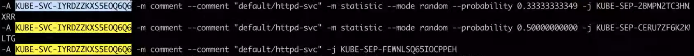
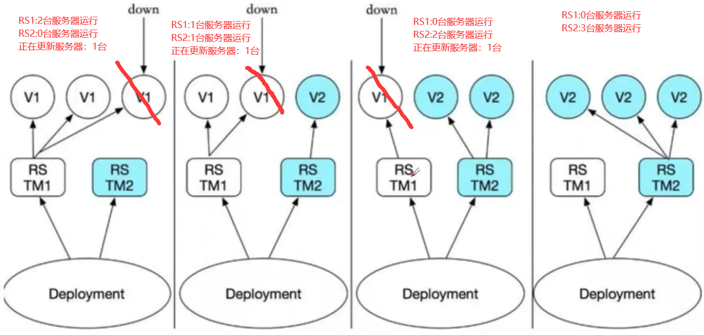

# Kubernetes

## 概述

* Kubernetes又称作k8s，是Google在2014年发布的一个开源项目。（大厂背书）
* 最初Google开发了一个叫Borg的系统(现在命名为Omega)，来调度近20多亿个容器。在积累了数十年的经验后，Google决定重写这个容器管理系统，并贡献给开源社区，而这个系统就是Kubernetes。它也是Omega的开源版本。（量大）
* 从2014年第一个版本发布l来，迅速得到了开源社区的追捧，目前，k&s已经成为了发展最快、市场占有率最高的容器编排引擎产品。（时间长）
* Kubernetes中文社区|中文文档：https://www.kubernetes.org.cn/k8s

云原生：k8s+configmap（配置中心，支持热加载）+etcd（存储配置、状态的发现中心）+servicemesh（网格服务）+CI/CD

servicemesh：由若干个SideCar组成，sidecar类似一个边三轮（抗日剧中的摩托车旁边带小坐车的那种）。其副座的作用是部署sidecar proxy，该 sidecar proxy 负责接管对应服务的入流量和出流量。并将微服务架构中以前有公共库、framework实现的熔断、限流、降级、服务发现、调用链分布式跟踪以及立体监控等功能从服务中抽离到该 proxy 中。（中小公司玩不起来）

CI/CD：将服务部署分为多个模块，自动将其模块按其依赖进行部署。不用再人工等待其他依赖组部署完毕后再进行模块部署。

## 安装k8s

* 设置阿里镜像，并且安装k8s

```shell
export REGISTRY_MIRROR=https://registry.cn-hangzhou.aliyuncs.com
curl -sSL https://kuboard.cn/install-script/v1.19.x/install_kubelet.sh | sh -s 1.19.2
```

## 安装minikube

* 使用命令下载minikube

```shell
curl -Lo minikube https://kubernetes.oss-cn-hangzhou.aliyuncs.com/minikube/releases/v1.13.0/minikube-linux-amd64 && chmod +x minikube && sudo mv minikube /usr/local/bin/
```


* 使用命令启动minikube，准备面对一堆bug吧！

```shell
minikube start
```

* 第一个bug：cpu核心不足2核，虚拟机就调高点cpu核心，云服务器就换一台，没有其他办法。

```shell
X Exiting due to RSRC_INSUFFICIENT_CORES:  has less than 2 CPUs available, but Kubernetes requires at least 2 to be available
```


* 第二个bug：马上买了一台新2g云服务器，再报第二个bug，这个bug是告诉你，你不能使用root用户启动，所以我们创建一个用户出来。

```
adduser test
passwd test
```

* 第三个bug：用户权限不在docker的权限组

```shell
X Exiting due to PROVIDER_DOCKER_ERROR: "docker version --format -" exit status 1: Got permission denied while trying to connect to the Docker daemon socket at unix:///var/run/docker.sock: Get http://%2Fvar%2Frun%2Fdocker.sock/v1.40/version: dial unix /var/run/docker.sock: connect: permission denied

```


```shell
#创建docker组
sudo groupadd docker
#将您的用户添加到该docker组
sudo usermod -aG docker $USER
#在Linux上，运行以下命令来激活对组的更改
newgrp docker
```

* 第四个bug：云服务器能存小于2g，准备买第三台服务器的时候看到，可以限制内存运行大小，于是乎就算了。

```shell
X Requested memory allocation (1734MB) is less than the recommended minimum 2000MB. Deployments may fail.

X The requested memory allocation of 1734MiB does not leave room for system overhead (total system memory: 1734MiB). You may face stability issues.
```


再次使用安装命令，至此，minikube安装完毕！

```
minikube start --driver=docker
```


* 第五个bug：并没有完，我的网站和数据库被这个的东西炸了，然而还是没启动好。看了下原因，它想让我重启我的docker容器。

```shell
X The requested memory allocation of 1734MiB does not leave room for system overhead (total system memory: 1734MiB). You may face stability issues.
* Suggestion: Start minikube with less memory allocated: 'minikube start --memory=1734mb'

* Starting control plane node minikube in cluster minikube
* Updating the running docker "minikube" container ...
* Preparing Kubernetes v1.19.0 on Docker 19.03.8 ...
* Verifying Kubernetes components...
! Executing "docker container inspect minikube --format={{.State.Status}}" took an unusually long time: 17.099887765s
* Restarting the docker service may improve performance.
! Executing "docker container inspect minikube --format={{.State.Status}}" took an unusually long time: 17.004489172s
* Restarting the docker service may improve performance.

```


使用命令关闭minikube，然后切换用户到root，关闭docker，切回用户再次开启docker，然后再次启动。

```shell
[zsptest@iZwz98yfu2kadknzb6lx9cZ test]$ 
[zsptest@iZwz98yfu2kadknzb6lx9cZ test]$ su
Password: 
[root@iZwz98yfu2kadknzb6lx9cZ test]# systemctl stop docker
[root@iZwz98yfu2kadknzb6lx9cZ test]# su zsptest
[zsptest@iZwz98yfu2kadknzb6lx9cZ test]$ systemctl start docker
==== AUTHENTICATING FOR org.freedesktop.systemd1.manage-units ===
Authentication is required to manage system services or units.
Authenticating as: root
Password: 
==== AUTHENTICATION COMPLETE ===
[zsptest@iZwz98yfu2kadknzb6lx9cZ test]$ docker ps
CONTAINER ID        IMAGE               COMMAND             CREATED             STATUS              PORTS               NAMES
[zsptest@iZwz98yfu2kadknzb6lx9cZ test]$ minikube start --driver=docker --memory=1734mb

```

再次启动，成功！说明一切就绪，可以开始玩k8s了！


## 基本命令

* 查看结点

```shell
[test@localhost root]$ kubectl get nodes
NAME       STATUS   ROLES    AGE   VERSION
minikube   Ready    master   18m   v1.19.0
```

 【解释】

```shell
node是用于承载运行中的容器的
有一个node，这个node的角色是master
k8s也有集群的概念，即：cluster，包含master和node，该节点就是master节点，也是node节点。
```

* 创建nginx的deployment

```shell
[test@localhost root]$ kubectl create deployment my-nginx --image nginx:latest 
    
deployment.apps/my-nginx created
```

【解释】

```shell
创建deployment其实有两种方式
1>基于命令行配置运行
 kubectl create
 kubectl create deployment my-nginx --image nginx:latest
 
 kubectl run
2>基于yaml配置文件的
 kubectl apply -f xxx.yml
 
 [test@localhost ~]$ kubectl create -f nginx-deployment.yaml
```

* 查看所有pod信息以及ip和port（想看更多信息就 -o wide）这个ip是可以ping通的：

```shell
 [test@localhost root]$ kubectl get pods
NAME                       READY   STATUS    RESTARTS   AGE
my-nginx-b7d7bc74d-447rv   1/1     Running   0          66m

[test@localhost root]$ kubectl get pods -o wide
NAME                       READY   STATUS    RESTARTS   AGE   IP           NODE       NOMINATED NODE   READINESS GATES
my-nginx-b7d7bc74d-447rv   1/1     Running   0          38m   172.18.0.3   minikube   <none>           <none>
```

* 查看所有service

```shell
[test@localhost root]$ kubectl get service
NAME         TYPE        CLUSTER-IP   EXTERNAL-IP   PORT(S)   AGE
kubernetes   ClusterIP   10.96.0.1    <none>        443/TCP   3h1m
```

* 查看所有的deploys

```shell
kubectl get deploys
```

【解释】

```shell
pod是不稳定的，服务可以保证稳定。
双十一之前，订单系统需要20个服务实例，双十一促销阶段，扩容至100个服务实例。双一之后，对服务缩容至30个服务实例。
我们是一个稳定的请求方式，统一个ip的,这个就是service的作用。
```

* 查询所有命名空间

```shell
[test@localhost root]$ kubectl get namespace
NAME              STATUS   AGE
default           Active   3h18m
kube-node-lease   Active   3h18m
kube-public       Active   3h18m
kube-system       Active   3h18m
```

【解释】

```
默认是default
其他kube-*的都是k8s系统自己的命名空间。
```

查看默认命名空间：可以看到默认的命名空间是default

```
kubectl describe deployment my-nginx
```


* 将副本数从1个修改为3个：设置完毕后查看pods，发现多了两个副本，查看deploy发现有三个就绪

```shell
[test@localhost root]$ kubectl scale deployments/my-nginx --replicas=3
deployment.apps/my-nginx scaled

[test@localhost root]$ kubectl get pods
NAME                       READY   STATUS    RESTARTS   AGE
my-nginx-b7d7bc74d-447rv   1/1     Running   0          3h17m
my-nginx-b7d7bc74d-f5vcl   1/1     Running   0          63s
my-nginx-b7d7bc74d-qlpv4   1/1     Running   0          63s

[test@localhost root]$ kubectl get pods -o wide
NAME                       READY   STATUS    RESTARTS   AGE     IP           NODE       NOMINATED NODE   READINESS GATES
my-nginx-b7d7bc74d-447rv   1/1     Running   0          3h23m   172.18.0.3   minikube   <none>           <none>
my-nginx-b7d7bc74d-f5vcl   1/1     Running   0          6m45s   172.18.0.5   minikube   <none>           <none>
my-nginx-b7d7bc74d-qlpv4   1/1     Running   0          6m45s   172.18.0.4   minikube   <none>           <none>

[test@localhost root]$ kubectl get deploy
NAME       READY   UP-TO-DATE   AVAILABLE   AGE
my-nginx   3/3     3            3           3h21m
```

【解释】

>* 什么是副本个数？
>
>  pod个数
>
>* 如果我们不指定副本个数的话，那么默认就是一个pod

* 将副本数从3个变成2个

```shell
[test@localhost ~]$ kubectl scale deployments/my-nginx --replicas=2
deployment.apps/my-nginx scaled

[test@localhost ~]$ kubectl get deploy
NAME               READY   UP-TO-DATE   AVAILABLE   AGE
my-nginx           2/2     2            2           20h
nginx-deployment   2/2     2            2           4h44m

[test@localhost ~]$ kubectl scale deployments/nginx-deployment --replicas=0
deployment.apps/nginx-deployment scaled

[test@localhost ~]$ kubectl get deploy
NAME               READY   UP-TO-DATE   AVAILABLE   AGE
my-nginx           2/2     2            2           20h
nginx-deployment   0/0     0            0           4h44m

```

## 重要概念

### Cluster

>​	资源的集合。我们的k8s利用这些资源运行各种基于容器的应用。

### Master

>Cluster的大脑。司令部。主要的任务就是用来调度的。决定我们的应用应该放到哪里去执行。
>
>为了高可用，也可以运行多个master。

### Nodes

>来负责运行容器应用。
>Node是由Master去管理的，负责监控和容器状态的汇报。一个虚拟机上的k8s就是一个node。

### Pod

>是k8s最小的工作单元，包含1 or N个容器
>
>pod使用方式：
>
>* 一个pod运行一个容器
>  * 最常用情况
>* 一个pod运行多个容器：
>  * 一定是非常紧密相关的一组容器，并且需要资源的共享。
>  * 一起启动、一起停止。

### controller

Controller ——>负责k8s运行容器的

>k8s通过它来管理Pod
>针对不同的业务场景，k8s提供了多种Controller，其中包含:Deployment、ReplicaSet、DaemonSet、StatefulSet、 Job

* Deployment(默认创建)

>就是我们最常用的Controller。它可以管理Pod的多个副本。(即:--replicas=3)，并且可以确保Pod按照期望的状态去运行。

* ReplicaSet(默认创建)

>我们使用deployment的时候，会自动的创建ReplicaSet，最终是有ReplicaSet去创建的pod，而我们并不是去直接的使用它。

* DaemonSet

>用于每个Node最多只运行一个Pod副本的创建。

* StatefulSet

>保证副本按照固定的顺序启动、更新、删除。

### Service

Service ——>负责k8s访问容器的。

>为Pod提供负载均衡、固定IP和Port。
>
>pod是不稳定的，ip会变化的。所以我们需要一个固定ip或port。
>
>区别：
>
>Controller ——>负责k8s运行容器的
>
>Service——>负责k8s访问容器的。

### Namespace

>主要目的：资源隔离。

### 总结

* Cluster——是计算、存储和网络资源的集合
* Master———Cluster的大脑,决定将应用放在哪里运行
* Node——职责是运行容器应用
* Pod———k8s的最小工作单元，包含1orN个容器。Controller——k8s通过它来管理Pod
* 包含:Deployment、ReplicaSet、DaemonSet、StatefulSet、Job
* Service———为Pod提供了负载均衡、固定的IP和Port
* Namespace——解决同一个Cluster中，如何区别分开Controller、
* Pod等资源的问题

## K8S架构

使用命令查找对应组件：Master和node对应组件如下

```shell
[test@localhost /]$ kubectl get pod --all-namespaces
```


查看上图可以得出两个结论：

* Kubernetes的系统组件都被放到kube-system的namespace中。
* kubelet是唯一没有以容器形式运行的Kubernetes组件。（没有pod）

### 部署流程

当我们执行部署应用并指定两个副本的时候，执行流程如下所示：

* Kubectl发送部署请求到API Server。（向k8s提供请求的）
* API Server通知Controller Manager创建一个deployment资源。
* Scheduler热行调度任务，将两个副本Pod分发到node1和node2上。
* node1和node2上的kubelet在各自的节点上创建并运行Pod。

示例：

```shell
[test@localhost root]$ kubectl scale deployments/my-nginx --replicas=2
```

k8s架构中，主要是由Master和Node组成的。下面我们来针对这两部分进行详细的介绍。

### Master和Node的组成

下面将分成两部分讲解Master和Node的组成：

#### Master

* API-Server

>属于前段交互接口。提供基于Http/Https RESTful API。
>
>主要功能：接受对应的指令。

* Scheduler

>负责决定将pod放到哪个Node上去运行的。

* Controller Manager

>非常关键的组件。管理cluster的各种资源。


* etcd

>基于内存。负责保存k8s的配置信息和各种资源的状态信息。
>
>服务通知：如果数据发生变化，例如pod状态变化了，etcd会快速通知相关组件。

* Pod网络

#### Node

* kubelet

>创造和运行容器

* kube-proxy

>负责我们请求的转发。
>
>如果对于多个副本，它会实现负载均衡。


### Deployment

​	deployment属于Master里的Controller Manager中replication的生命周期中。

#### 创建资源

* 方式1：

kubectl命令直接创建。
比如:（过期,已经废弃）

```shell
kubectl run nginx-deployment --image=nginx:1.7.9 --replicas=2
```

在命令行中通过参数指定资源的属性。(但是，在K8S v1.18.0l后，一replicas已弃用,推荐用kubectl apply创建pods)
比如:

```shell
[test@localhost /]$ kubectl create deployment test-nginx --image nginx:1.7.9 --replicas=2

deployment.apps/test-nginx created
```

缺陷：配置不全。

* 方式2：

通过配置文件和kubectl apply创建。

步骤︰

>* 编写yml配置文件。(下一页有书写样例, nginx.yml)
>* 执行命令: 

```shell
 kubectl apply -f /home/muse/nginx.yml
```

#### 删除资源

* 删除pod

```shell
[test@localhost k8s]$ kubectl delete  pods nginx-deployment-594554fc86-xmd5w 
pod "nginx-deployment-594554fc86-xmd5w" deleted
[test@localhost k8s]$ kubectl get pods 
NAME                                READY   STATUS    RESTARTS   AGE
my-nginx-b7d7bc74d-f5vcl            1/1     Running   5          5d2h
my-nginx-b7d7bc74d-qlpv4            1/1     Running   5          5d2h
nginx-app-7848d4b86f-g9k2v          1/1     Running   0          8h
nginx-app-7848d4b86f-jxvw4          1/1     Running   0          8h
nginx-deployment-594554fc86-4gz5v   0/1     Pending   0          13s
nginx-deployment-7f4fc68488-6b2rm   1/1     Running   0          144m
nginx-deployment-7f4fc68488-9pncf   1/1     Running   0          18m
nginx-deployment-7f4fc68488-whplv   1/1     Running   0          144m
```

* 删除deployment

```shell
[test@localhost /]$ kubectl delete deploy test-nginx --namespace=default
deployment.apps "test-nginx" deleted
```

#### 修改资源

* 修改pod的数量为3

```shell
[test@localhost root]$ kubectl scale deployments/my-nginx --replicas=3
deployment.apps/my-nginx scaled
```

#### 查询资源

* 查看信息（deployment，pods，service等，拼写可以不拼完）

```shell
[test@localhost k8s]$ kubectl get deploy
[test@localhost k8s]$ kubectl get pods
[test@localhost k8s]$ kubectl get service
```

* 查看略详细信息：多了ip等（加上-o wide即可）

```shell
[test@localhost k8s]$ kubectl get deploy -o wide
```

* 查看最详细信息

```
kubectl describe deployment nginx-app
```

#### 创建过程解析 

 用户通过kubectl-->使用yml文件创建Deployment-->创建ReplicaSet-->创建Pod（也就是说系统帮我们创建了pod）


​	这里我们查看一下nginx-app的创建过程：

```shell
[test@localhost k8s]$ kubectl describe deployment nginx-deployment
```


跟踪replicaset，查看创建pod的过程：

```shell
[test@localhost k8s]$ kubectl describe rs  nginx-deployment-7f4fc68488
```


跟踪pod，查看创建pod的过程：

```shell
[test@localhost k8s]$ kubectl describe pod  nginx-deployment-7f4fc68488-6b2rm
```


### 集群下的K8S

#### Failover机制

在k8s中，一个node是一个虚拟机上的k8s整体，这里的node1和node2就是两台机子。

这里模拟下node1故障的情况：

* node1发生了错误/灾害/恶意破坏，故障了
* 此时Master会维持pod数量依旧为3，所以会在node2下创建两个结点
* 然后删除node1的两个结点
  * 为防止Node1的突然连上，然后又要恢复pod数量为3。
  * 为防止Node1因为网络频闪，反复进行删除和创建操作。
* 此时node1为空，node2有三个pod，如果此时修改配置需要5个pods，则会优先创建在Node1上，维持平衡。

 

#### label标签

​	默认配置下，Scheduler会将Pod调度到所有可用的Node（自动分配）。不过有些情况我们可以通过lable将Pod部署到指定的Node，比如将有大量磁盘I/O的Pod部署到配置了SSD的Node;或者Pod需要GPU,需要运行在配置了GPU的节点上。

特别注意：Node表示一个虚拟机/物理机上的K8S，也就是我们一台机子上为固态SSD，我们可以打上标签，让其优先选择。

**设置标签步骤：**

* 查看所有node的标签情况。

```shell
[test@localhost k8s]$ kubectl get nodes --show-labels
NAME       STATUS   ROLES    AGE    VERSION   LABELS
minikube   Ready    master   5d6h   v1.19.0   beta.kubernetes.io/arch=amd64,beta.kubernetes.io/os=linux,kubernetes.io/arch=amd64,kubernetes.io/hostname=minikube,kubernetes.io/os=linux,minikube.k8s.io/commit=23aa1eb200a03ae5883dd9d453d4daf3e0f59668,minikube.k8s.io/name=minikube,minikube.k8s.io/updated_at=2021_10_27T18_07_49_0700,minikube.k8s.io/version=v1.13.0,node-role.kubernetes.io/master=
```

* 给node设置标签

```shell
[test@localhost k8s]$ kubectl label node minikube disktype=ssd
node/minikube labeled
[test@localhost k8s]$ kubectl get nodes --show-labels
NAME       STATUS   ROLES    AGE    VERSION   LABELS
minikube   Ready    master   5d6h   v1.19.0   beta.kubernetes.io/arch=amd64,beta.kubernetes.io/os=linux,disktype=ssd,kubernetes.io/arch=amd64,kubernetes.io/hostname=minikube,kubernetes.io/os=linux,minikube.k8s.io/commit=23aa1eb200a03ae5883dd9d453d4daf3e0f59668,minikube.k8s.io/name=minikube,minikube.k8s.io/updated_at=2021_10_27T18_07_49_0700,minikube.k8s.io/version=v1.13.0,node-role.kubernetes.io/master=
```

* 修改配置文件：加上以下内容

>```yml
>  nodeSelector:
>    node: "disktype"
>```

文件总体为：

```yml
 # 内容
apiVersion: apps/v1
kind: Deployment
metadata:
 name: nginx-deployment
spec:
  replicas: 3
  selector:
    matchLabels:
      app: nginx
  template:
    metadata:
      labels:
        app: nginx
    spec:
      containers:
      - name: nginx
        image: nginx:1.17
        ports:
        - containerPort: 80
      nodeSelector:
        node: "disktype"
```

* 重新部署文件

```shell
[test@localhost k8s]$ kubectl apply -f nginx.yml
deployment.apps/nginx-deployment configured
```

* 查看node的标签信息

```shell
[test@localhost k8s]$ kubectl get node --show-labels
NAME       STATUS   ROLES    AGE    VERSION   LABELS
minikube   Ready    master   5d6h   v1.19.0   beta.kubernetes.io/arch=amd64,beta.kubernetes.io/os=linux,disktype=ssd,kubernetes.io/arch=amd64,kubernetes.io/hostname=minikube,kubernetes.io/os=linux,minikube.k8s.io/commit=23aa1eb200a03ae5883dd9d453d4daf3e0f59668,minikube.k8s.io/name=minikube,minikube.k8s.io/updated_at=2021_10_27T18_07_49_0700,minikube.k8s.io/version=v1.13.0,node-role.kubernetes.io/master=
```

* 去掉指定标签

```shell
[test@localhost k8s]$ kubectl label node minikube disktype-
node/minikube labeled

[test@localhost k8s]$  kubectl get node --show-labels
NAME       STATUS   ROLES    AGE    VERSION   LABELS
minikube   Ready    master   5d6h   v1.19.0   beta.kubernetes.io/arch=amd64,beta.kubernetes.io/os=linux,kubernetes.io/arch=amd64,kubernetes.io/hostname=minikube,kubernetes.io/os=linux,minikube.k8s.io/commit=23aa1eb200a03ae5883dd9d453d4daf3e0f59668,minikube.k8s.io/name=minikube,minikube.k8s.io/updated_at=2021_10_27T18_07_49_0700,minikube.k8s.io/version=v1.13.0,node-role.kubernetes.io/master=
```

#### DaemonSet

​	Deployment部署的副本Pod会分布在各个Node上，每个Node都可能运行好几个副本。DaemonSet的不同之处在于∶每个Node上最多只能运行一个副本。

**DaemonSet的典型应用场景**

* 在每个节点上运行存储Daemon，比如glusterd或ceph。
* 在每个节点上运行日志收集Daemon，比如flunentd或logstash。
* 在每个节点上运行监控Daemon，比如Prometheus Node Exporter或collectd.

**查看使用daemonset的组件**

* 查看k8s自己就用DaemonSet运行系统组件

```shell
[test@localhost k8s]$ kubectl get daemonset --namespace=kube-system
NAME         DESIRED   CURRENT   READY   UP-TO-DATE   AVAILABLE   NODE SELECTOR            AGE
kube-proxy   1         1         1       1            1           kubernetes.io/os=linux   5d7h
```

#### Job

* 容器分类：工作类容器 / 服务器容器
  * 服务器容器:服务类容器通常持续提供服务，需要一直运行，比如HTTP Server、Daemon等。Kubernetes的Deployment、
    ReplicaSet和DaemonSet都用于管理服务类容器﹔
  * 工作类容器:工作类容器是一次性任务，比如批处理程序，完成后容器就退出。对于工作类容器，我们使用Job。


##### 创建一个job

* 编写一个myjob.yml

```yml
apiVersion: batch/v1
kind: Job
metadata:
    name: myjob
spec:
  template:
    metadata:
        name: myjob
    spec:
      containers:
      - name: hello
        image: busybox
        command: ["echo", "hello k8s job! "]
        #command:["invalid_command"，"hello k8s job! "]
      restartPolicy: Never
#restartPolicy: OnFailure
```

* 创建job

```shell
[test@localhost k8s]$ kubectl apply -f myjob.yml 
job.batch/myjob created
```

* 查看job

```shell
[test@localhost k8s]$ kubectl get jobs
NAME    COMPLETIONS   DURATION   AGE
myjob   1/1           8s         86s
```

* 查看pods里和其他的容器有什么不同
  * 不同：READY是0/1,状态是Completed

```
[test@localhost k8s]$ kubectl get pods
NAME                                READY   STATUS      RESTARTS   AGE
my-nginx-b7d7bc74d-f5vcl            1/1     Running     5          5d3h
my-nginx-b7d7bc74d-qlpv4            1/1     Running     5          5d3h
myjob-488fp                         0/1     Completed   0          93s
nginx-app-7848d4b86f-g9k2v          1/1     Running     0          9h
nginx-app-7848d4b86f-jxvw4          1/1     Running     0          9h
nginx-deployment-594554fc86-4gz5v   0/1     Pending     0          50m
nginx-deployment-7f4fc68488-6b2rm   1/1     Running     0          3h14m
nginx-deployment-7f4fc68488-9pncf   1/1     Running     0          68m
nginx-deployment-7f4fc68488-whplv   1/1     Running     0          3h14m
```

* 查看日志的输出情况

```shell
[test@localhost k8s]$ kubectl logs myjob-488fp
hello k8s job! 
```

* 接下去修改文件变成失败的

```yml
apiVersion: batch/v1
kind: Job
metadata:
    name: myjob
spec:
  template:
    metadata:
        name: myjob
    spec:
      containers:
      - name: hello
        image: busybox
        #command: ["echo", "hello k8s job! "]
        command:["invalid_command"，"hello k8s job! "]
      restartPolicy: Never
#restartPolicy: OnFailure
```

* 删除原本的job：发现都没有了

```shell
[test@localhost k8s]$ kubectl delete job myjob
job.batch "myjob" deleted

[test@localhost k8s]$ kubectl get job
No resources found in default namespace.
[test@localhost k8s]$ kubectl get pods
NAME                                READY   STATUS    RESTARTS   AGE
my-nginx-b7d7bc74d-f5vcl            1/1     Running   5          5d3h
my-nginx-b7d7bc74d-qlpv4            1/1     Running   5          5d3h
nginx-app-7848d4b86f-g9k2v          1/1     Running   0          9h
nginx-app-7848d4b86f-jxvw4          1/1     Running   0          9h
nginx-deployment-594554fc86-4gz5v   0/1     Pending   0          67m
nginx-deployment-7f4fc68488-6b2rm   1/1     Running   0          3h31m
nginx-deployment-7f4fc68488-9pncf   1/1     Running   0          85m
nginx-deployment-7f4fc68488-whplv   1/1     Running   0          3h31m
```

* 运行job并查看
  * 会发现运行了三个job，这是因为：
    * 我们的重启策略是 restartPolicy: Never，无法运行且无法重启就只能一直创建出新的

```shell
[test@localhost k8s]$ kubectl apply -f myjob.yml 
job.batch/myjob created

[test@localhost k8s]$ kubectl get job
NAME    COMPLETIONS   DURATION   AGE
myjob   0/1           14s        14s

[test@localhost k8s]$ kubectl get pods
NAME                                READY   STATUS               RESTARTS   AGE
myjob-74dg2                         0/1     ContainerCreating    0          3s
myjob-9f57n                         0/1     ContainerCannotRun   0          13s
myjob-qbmb4                         0/1     ContainerCannotRun   0          19s

[test@localhost k8s]$ kubectl get pods
NAME                                READY   STATUS               RESTARTS   AGE
myjob-74dg2                         0/1     ContainerCannotRun   0          118s
myjob-9f57n                         0/1     ContainerCannotRun   0          2m8s
myjob-qbmb4                         0/1     ContainerCannotRun   0          2m14s
myjob-shvf7                         0/1     ContainerCannotRun   0          18s
myjob-vqms4                         0/1     ContainerCannotRun   0          98s

```

* 删除后修改 restartPolicy: Never为restartPolicy: OnFailure即可。
  * OnFailure表示，失败后进行重启，不会无限创建容器。

```shell
apiVersion: batch/v1
kind: Job
metadata:
    name: myjob
spec:
  template:
    metadata:
        name: myjob
    spec:
      containers:
      - name: hello
        image: busybox
        #command: ["echo", "hello k8s job! "]
        command: ["invalid_command","hello k8s job! "]
      #restartPolicy: Never
      restartPolicy: OnFailure
```

* 重新运行，容器没有再无限创建出来，采取的是重启方式

```shell
[test@localhost k8s]$ kubectl apply -f myjob.yml 
job.batch/myjob created
[test@localhost k8s]$ kubectl get pods
NAME                                READY   STATUS              RESTARTS   AGE
myjob-6q5ls                         0/1     RunContainerError   0          14s
[test@localhost k8s]$ kubectl get pods
NAME                                READY   STATUS              RESTARTS   AGE
myjob-6q5ls                         0/1     RunContainerError   1          25s
```

##### 跑多个job

* 先改配置文件

```shell
apiVersion: batch/v1
kind: Job
metadata:
    name: myjob
spec:
  #创建6个任务
  completions: 6
  template:
    metadata:
        name: myjob
    spec:
      containers:
      - name: hello
        image: busybox
        #command: ["echo", "hello k8s job! "]
        command: ["invalid_command","hello k8s job! "]
      #restartPolicy: Never
      restartPolicy: OnFailure
```

* 启动并查看job

```shell
[test@localhost k8s]$ kubectl apply -f myjob.yml 
job.batch/myjob created
[test@localhost k8s]$ kubectl get job
NAME    COMPLETIONS   DURATION   AGE
myjob   1/6           9s         9s
[test@localhost k8s]$ kubectl get pods
NAME                                READY   STATUS              RESTARTS   AGE
myjob-88wpb                         0/1     Completed           0          19s
myjob-cvqd9                         0/1     Completed           0          8s
myjob-jx67v                         0/1     ContainerCreating   0          2s
myjob-vhhb6                         0/1     Completed           0          13s
```

##### 并行job

* 写yml配置文件：并行创建2个任务，分三组，一次同时执行2个，执行三次

```yml
apiVersion: batch/v1
kind: Job
metadata:
    name: myjob
spec:
  #创建6个任务
  #completions: 6
  #并行创建2个任务，分三组，一次同时执行2个，执行三次
  parallelism: 2
  template:
    metadata:
        name: myjob
    spec:
      containers:
      - name: hello
        image: busybox
        command: ["echo", "hello k8s job! "]
        #command: ["invalid_command","hello k8s job! "]
      #restartPolicy: Never
      restartPolicy: OnFailure
```

* 运行任务并且查看pods和job

```shell
[test@localhost k8s]$ kubectl apply -f myjob.yml 
job.batch/myjob created
[test@localhost k8s]$ kubectl get pods
NAME                                READY   STATUS              RESTARTS   AGE
myjob-mcqsw                         0/1     ContainerCreating   0          7s
myjob-pgjcn                         0/1     ContainerCreating   0          7s
[test@localhost k8s]$ kubectl get jobs
NAME    COMPLETIONS   DURATION   AGE
myjob   2/1 of 2      12s        13s
```

* 尝试运行6个任务并行2个

```shell
[test@localhost k8s]$ kubectl apply -f myjob.yml 
job.batch/myjob created
[test@localhost k8s]$ kubectl get jobs
NAME    COMPLETIONS   DURATION   AGE
myjob   3/6           18s        18s
[test@localhost k8s]$ kubectl get pods
NAME                                READY   STATUS      RESTARTS   AGE
myjob-4x2fb                         0/1     Completed   0          14s
myjob-5nbg2                         0/1     Completed   0          23s
myjob-cskdt                         0/1     Completed   0          10s
myjob-d7h7n                         0/1     Completed   0          17s
myjob-z5ntw                         0/1     Completed   0          29s
myjob-zcq26                         0/1     Completed   0          29s
```

##### 定时任务

* 编写yml文件

```yml
apiVersion: batch/v2alpha1
kind: CronJob
metadata:
    name: CronJob
spec:
  schedule: "*/1 * * * *"
  jobTemplate:
   spec:
    template:
      spec:
        containers:
       - name: hello
         image: busybox
         command: ["echo", "hello k8s job! "]
         #command: ["invalid_command","hello k8s job! "]
      #restartPolicy: Never
       restartPolicy: OnFailure
```

* 运行yml配置文件报错 （bug又来了）

```shell
[test@localhost k8s]$ kubectl apply -f MyCronJob.yml 
error: unable to recognize "MyCronJob.yml": no matches for kind "CronJob" in version "batch/v2alpha1"
```

* 使用指令，查看当前版本

```shell
[test@localhost k8s]$ kubectl api-versions
admissionregistration.k8s.io/v1
admissionregistration.k8s.io/v1beta1
apiextensions.k8s.io/v1
apiextensions.k8s.io/v1beta1
apiregistration.k8s.io/v1
apiregistration.k8s.io/v1beta1
。。。。。。
```

* 进入k8s的配置类，`/etc/kubernetes/manifests/kube-apiserver.yaml，`找来找去并没有，manifests是个空文件夹！！！
  * 是一个巨坑，我找了一早上。通过csdn，掘金，到stackoverflow，甚至github仓库里的issue里，始终没有得到满意的答复。
  * 后面我想了下，minikube也是一个容器，会不会是在容器中！使用命令即可：
  * 最后，我如愿找到了这个坑爹的文件

```shell
[test@localhost manifests]$ docker exec -it minikube bash
root@minikube:/# ls
Release.key                 bin   data  etc   kic.txt  lib    lib64   media  opt   root  sbin  sys  usr
afbjorklund-public.key.asc  boot  dev   home  kind     lib32  libx32  mnt    proc  run   srv   tmp  var
root@minikube:/# cd etc/k
kernel/     kubernetes/ 
root@minikube:/# cd etc/kubernetes/manifests/
root@minikube:/etc/kubernetes/manifests# ls
etcd.yaml  kube-apiserver.yaml  kube-controller-manager.yaml  kube-scheduler.yaml
```

* 追加进文件中，由于容器没有vi也没有vim，所以直接追加进去。
  * 先用cat获取要插入的行数
  * 在要插入的行数中使用

```shell
root@minikube:/etc/kubernetes/manifests# cat -n  kube-apiserver.yaml 
root@minikube:/etc/kubernetes/manifests# sed -i '16i\    - --runtime-config=batch/v2alpha1=true;' kube-apiserver.yaml
```

* 修改完毕重启后，再出一个bug

```shell
[root@localhost k8s]# kubectl get pods
The connection to the server localhost:8080 was refused - did you specify the right host or port?
```

* 重新返回test用户发现可以使用了，这东西真的bug多。

* 最后我发现第二个方法，不用去改配置文件，只要把版本号改一下就可以了。

```yml
[test@localhost k8s]$ vim MyCronJob.yml
apiVersion: batch/v1beta1
kind: CronJob
metadata:
  name: hello
spec:
  schedule: "*/1 * * * *"
  jobTemplate:
    spec:
      template:
        spec:
          containers:
          - name: hello
            image: busybox
            args:
            - /bin/sh
            - -c
            - date; echo Hello from the Kubernetes cluster
          restartPolicy: OnFailure
```

* 执行并查看情况
  * 查看cronjobs：会发现每过1分钟会运行一次定时任务
  * 查看jobs：运行3分钟，产生了3条记录
  * 查看pods：也会出现

```shell
[test@localhost k8s]$ kubectl apply -f MyCronJob.yml
[test@localhost k8s]$ kubectl get cronjobs
NAME    SCHEDULE      SUSPEND   ACTIVE   LAST SCHEDULE   AGE
hello   */1 * * * *   False     0        36s             3m23s
[test@localhost k8s]$ kubectl get job
NAME               COMPLETIONS   DURATION   AGE
hello-1635919080   1/1           6s         2m13s
hello-1635919140   1/1           6s         73s
hello-1635919200   1/1           10s        13s
myjob              6/6           27s        3h52m
[test@localhost k8s]$ kubectl get pods
NAME                                READY   STATUS      RESTARTS   AGE
hello-1635919740-466cw              0/1     Completed   0          2m59s
hello-1635919800-zt4ll              0/1     Completed   0          119s
hello-1635919860-h8h64              0/1     Completed   0          59s
```

#### Service

* 我们不应该期望Pod是健壮的，而是要假设Pod中的容器很可能因为各种原因发生故障而死棹。
* Deployment等Controller会通过动态创建和销毁Pod来保证应用整体的健壮性。换句话说，Pod是脆弱的，但应用是健壮的。
* Service提供了固定的ip和端口，并且里面包含一组pod，即使Pod的ip发生变化，但是面对客户端的是Service的固定ip和端口。

##### service打包pods

* 编写配置文件

```yml
 # 内容
apiVersion: apps/v1
kind: Deployment
metadata:
 name: httpd
spec:
#创建三个容器
  replicas: 3
  selector:
    matchLabels:
      run: httpd
  template:
    metadata:
      labels:
        run: httpd
    spec:
      containers:
      - name: nginx
        image: nginx
        ports:
        #开启80端口
        - containerPort: 80
```

* 使用配置文件跑三个容器起来

```shell
[test@localhost k8s]$ kubectl apply -f httpd.yml 
deployment.apps/httpd created
[test@localhost k8s]$ kubectl get pods
NAME                                READY   STATUS              RESTARTS   AGE
httpd-5cbd65d46c-7l55b              0/1     ContainerCreating   0          41s
httpd-5cbd65d46c-7tln6              0/1     ContainerCreating   0          41s
httpd-5cbd65d46c-hs5hc              0/1     ContainerCreating   0          41s
```

* 写一个service配置文件用来打包这三个pod
  * 这里特别注意，selector要和所要打包的selector对应起来。

```yml
# 内容
apiVersion: v1
kind: Service
metadata:
 name: httpd-svc
spec:
  selector:
#选择器决定了绑定的pods，对应的pods的要和他一样。
    run: httpd
  ports:
  - protocol: TCP
    port: 8080
    targetPort: 80
```

* 执行httpdSVC.yml，可以执行curl 8080端口查看是否能够访问

```shell
[test@localhost k8s]$ kubectl apply -f httpdSVC.yml 
service/httpd-svc created
[test@localhost k8s]$ kubectl get svc
NAME            TYPE        CLUSTER-IP      EXTERNAL-IP   PORT(S)        AGE
httpd-svc       ClusterIP   10.111.147.9    <none>        8080/TCP       63s
[test@localhost k8s]$ curl 10.111.147.9:8080
```

* 查看service是否绑定上了pods：发现确实是以8080端口绑定上了3个容器的80端口

```shell
[test@localhost k8s]$ kubectl describe service httpd-svc
Name:              httpd-svc
Namespace:         default
Labels:            <none>
Annotations:       <none>
Selector:          run=httpd
Type:              ClusterIP
IP:                10.111.147.9
Port:              <unset>  8080/TCP
TargetPort:        80/TCP
Endpoints:         172.18.0.11:80,172.18.0.13:80,172.18.0.14:80
Session Affinity:  None
Events:            <none>
[test@localhost k8s]$ kubectl get pods -o wide 
NAME                                READY   STATUS    RESTARTS   AGE     IP            NODE       NOMINATED NODE   READINESS GATES
httpd-c794d9c5f-6rpws               1/1     Running   0          30m     172.18.0.13   minikube   <none>           <none>
httpd-c794d9c5f-drf4q               1/1     Running   0          30m     172.18.0.14   minikube   <none>           <none>
httpd-c794d9c5f-r7vv9               1/1     Running   0          30m     172.18.0.11   minikube   <none>           <none>
```

* 通过iptables查看映射规则（要切回root用户）

```shell
[root@localhost k8s]# iptables-save 
```

* 通过涂白的KUBE-SVC进行链接pods，跳转规则：
  * 一开始容器跳转概率为1/3
  * 第二个容器跳转概率为：(1-第一个容器的跳转概率)*0.5
  * 第三个容器为剩下概率




#### Rolling Update

​	滚动更新是一次只更新一小部分副本，成功后再更新更多的副本，最终完成所有副本的更新。滚动更新的最大好处是零停机，整个更新过程始终有副本在运行，从而保证了业务的连续性。



##### 滚动更新

* 先用yml创建一个低版本nginx的pods

```yml
 # 内容
apiVersion: apps/v1
kind: Deployment
metadata:
 name: httpd
spec:
#创建三个容器
  replicas: 3
  selector:
    matchLabels:
      run: httpd
  template:
    metadata:
      labels:
        run: httpd
    spec:
      containers:
      - name: nginx:1.17
        image: nginx:1.17
        ports:
        #开启80端口
        - containerPort: 80
```

* 执行文件

```shell
[test@localhost k8s]$ kubectl apply -f httpdRollingUpdate.yml 
deployment.apps/httpd configured
[test@localhost k8s]$ kubectl get deployment -o wide 
NAME               READY   UP-TO-DATE   AVAILABLE   AGE     CONTAINERS   IMAGES         SELECTOR
httpd              3/3     3            3           112m    nginx        nginx:1.17     run=httpd
[test@localhost k8s]$ kubectl get pods 
NAME                                READY   STATUS    RESTARTS   AGE
httpd-5575684c56-2l6rb              1/1     Running   0          3m33s
httpd-5575684c56-6nv2g              1/1     Running   0          3m16s
httpd-5575684c56-cjqcz              1/1     Running   0          3m26s
```

* 修改配置文件

```yml
 # 内容
apiVersion: apps/v1
kind: Deployment
metadata:
 name: httpd
spec:
#创建三个容器
  replicas: 3
  selector:
    matchLabels:
      run: httpd
  template:
    metadata:
      labels:
        run: httpd
    spec:
      containers:
      - name: nginx
        image: nginx:1.21.3
        ports:
        #开启80端口
        - containerPort: 80
```

* 重新跑一次apply：由于本地有镜像，所以整个过程非常快，但是没事，我们去deployment看

```shell
[test@localhost k8s]$ kubectl apply -f  httpdRollingUpdate.yml 
deployment.apps/httpd configured
[test@localhost k8s]$  kubectl get deployment -o wide 
NAME               READY   UP-TO-DATE   AVAILABLE   AGE     CONTAINERS   IMAGES         SELECTOR
httpd              3/3     3            3           124m    nginx        nginx:1.21.3   run=httpd
my-nginx           1/1     1            1           6d21h   nginx        nginx:latest   app=my-nginx
nginx-app          1/1     1            1           2d      nginx        nginx          app=nginx
nginx-deployment   1/1     1            1           42h     nginx        nginx:1.17     app=nginx
[test@localhost k8s]$ kubectl get pods
NAME                                READY   STATUS        RESTARTS   AGE
httpd-5575684c56-2l6rb              0/1     Terminating   0          16m
httpd-5c9954f4f4-dbdkg              1/1     Running       0          12s
httpd-5c9954f4f4-qk6z2              1/1     Running       0          24s
httpd-5c9954f4f4-sbhgn              1/1     Running       0          18s
```

* 使用describe查看deployment

```shell
[test@localhost k8s]$ kubectl describe deployment httpd
Events:
  Type    Reason             Age    From                   Message
  ----    ------             ----   ----                   -------
  Normal  ScalingReplicaSet  17m    deployment-controller  Scaled up replica set httpd-5575684c56 to 1
  Normal  ScalingReplicaSet  17m    deployment-controller  Scaled down replica set httpd-c794d9c5f to 2
  Normal  ScalingReplicaSet  17m    deployment-controller  Scaled up replica set httpd-5575684c56 to 2
  Normal  ScalingReplicaSet  17m    deployment-controller  Scaled down replica set httpd-c794d9c5f to 1
  Normal  ScalingReplicaSet  17m    deployment-controller  Scaled up replica set httpd-5575684c56 to 3
  Normal  ScalingReplicaSet  17m    deployment-controller  Scaled down replica set httpd-c794d9c5f to 0
  Normal  ScalingReplicaSet  2m15s  deployment-controller  Scaled up replica set httpd-5c9954f4f4 to 1
  Normal  ScalingReplicaSet  2m9s   deployment-controller  Scaled down replica set httpd-5575684c56 to 2
  Normal  ScalingReplicaSet  2m9s   deployment-controller  Scaled up replica set httpd-5c9954f4f4 to 2
  Normal  ScalingReplicaSet  2m3s   deployment-controller  Scaled down replica set httpd-5575684c56 to 1
  Normal  ScalingReplicaSet  2m3s   deployment-controller  Scaled up replica set httpd-5c9954f4f4 to 3
  Normal  ScalingReplicaSet  116s   deployment-controller  Scaled down replica set httpd-5575684c56 to 0
[test@localhost k8s]$ kubectl get replicasets
NAME                          DESIRED   CURRENT   READY   AGE
httpd-5575684c56              0         0         0       91m
httpd-5c9954f4f4              3         3         3       76m
```

这里来解析一下events：

* 刚开始由ReplicaSet的httpd-5575684c56管理三个老旧的容器
* 发布了新版本更新后，replicaset会将依次将容器进行更新然后发布，这就是滚动更新。

#####  更新回滚

* 先创建三个配置类，当成三个版本：

v1版本

```yml
 # 内容
apiVersion: apps/v1
kind: Deployment
metadata:
 name: httpd
spec:
#创建三个容器
  replicas: 3
  selector:
    matchLabels:
      run: httpd
  template:
    metadata:
      labels:
        run: httpd
    spec:
      containers:
      - name: nginx
        image: nginx:1.21.1
        ports:
        #开启80端口
        - containerPort: 80
```

v2版本

```shell
 # 内容
apiVersion: apps/v1
kind: Deployment
metadata:
 name: httpd
spec:
#创建三个容器
  replicas: 3
  selector:
    matchLabels:
      run: httpd
  template:
    metadata:
      labels:
        run: httpd
    spec:
      containers:
      - name: nginx
        image: nginx:1.21.2
        ports:
        #开启80端口
        - containerPort: 80
```

v3版本

```yml
 # 内容
apiVersion: apps/v1
kind: Deployment
metadata:
 name: httpd
spec:
#创建三个容器
  replicas: 3
  selector:
    matchLabels:
      run: httpd
  template:
    metadata:
      labels:
        run: httpd
    spec:
      containers:
      - name: nginx
        image: nginx:1.21.3
        ports:
        #开启80端口
        - containerPort: 80
```

* 进行版本更新。要想版本回滚，一定要加上--record！！！

```shell
[test@localhost k8s]$ kubectl get deployment -o wide
NAME               READY   UP-TO-DATE   AVAILABLE   AGE     CONTAINERS   IMAGES         SELECTOR
httpd              3/3     3            3           88s     nginx        nginx:1.17     run=httpd
my-nginx           1/1     1            1           6d23h   nginx        nginx:latest   app=my-nginx
nginx-app          1/1     1            1           2d3h    nginx        nginx          app=nginx
nginx-deployment   1/1     1            1           44h     nginx        nginx:1.17     app=nginx
[test@localhost k8s]$ kubectl apply -f httpd_v2.yml --record
deployment.apps/httpd configured
[test@localhost k8s]$ kubectl get deployment -o wide
NAME               READY   UP-TO-DATE   AVAILABLE   AGE     CONTAINERS   IMAGES         SELECTOR
httpd              3/3     1            3           7m53s   nginx        nginx:1.21.2   run=httpd
my-nginx           1/1     1            1           6d23h   nginx        nginx:latest   app=my-nginx
nginx-app          1/1     1            1           2d3h    nginx        nginx          app=nginx
nginx-deployment   1/1     1            1           44h     nginx        nginx:1.17     app=nginx
[test@localhost k8s]$ kubectl apply -f httpd_v3.yml --record
deployment.apps/httpd configured
[test@localhost k8s]$ kubectl get deployment -o wide
NAME               READY   UP-TO-DATE   AVAILABLE   AGE     CONTAINERS   IMAGES         SELECTOR
httpd              3/3     3            3           9m12s   nginx        nginx:1.21.3   run=httpd
my-nginx           1/1     1            1           6d23h   nginx        nginx:latest   app=my-nginx
nginx-app          1/1     1            1           2d3h    nginx        nginx          app=nginx
nginx-deployment   1/1     1            1           44h     nginx        nginx:1.17     app=nginx

```

* 进行版本回溯查看

```shell
[test@localhost k8s]$ kubectl rollout history deployment httpd
deployment.apps/httpd 
REVISION  CHANGE-CAUSE
1         kubectl apply --filename=httpd_v1.yml --record=true
2         kubectl apply --filename=httpd_v2.yml --record=true
3         kubectl apply --filename=httpd_v3.yml --record=true
```

* 进行版本回溯

```shell
[test@localhost k8s]$ kubectl rollout undo deployment httpd --to-revision=1
deployment.apps/httpd rolled back
[test@localhost k8s]$ kubectl get deployment -o wide
NAME               READY   UP-TO-DATE   AVAILABLE   AGE     CONTAINERS   IMAGES         SELECTOR
httpd              3/3     3            3           14m     nginx        nginx:1.17     run=httpd
my-nginx           1/1     1            1           6d23h   nginx        nginx:latest   app=my-nginx
nginx-app          1/1     1            1           2d3h    nginx        nginx          app=nginx
nginx-deployment   1/1     1            1           44h     nginx        nginx:1.17     app=nginx
```

* 当然想滚哪里就滚哪里，只要你有记录下来

```shell
[test@localhost k8s]$ kubectl get deployment -o wide
NAME               READY   UP-TO-DATE   AVAILABLE   AGE     CONTAINERS   IMAGES         SELECTOR
httpd              3/3     3            3           14m     nginx        nginx:1.17     run=httpd
my-nginx           1/1     1            1           6d23h   nginx        nginx:latest   app=my-nginx
nginx-app          1/1     1            1           2d3h    nginx        nginx          app=nginx
nginx-deployment   1/1     1            1           44h     nginx        nginx:1.17     app=nginx
[test@localhost k8s]$ kubectl rollout history deployment httpd
deployment.apps/httpd 
REVISION  CHANGE-CAUSE
2         kubectl apply --filename=httpd_v2.yml --record=true
3         kubectl apply --filename=httpd_v3.yml --record=true
4         kubectl apply --filename=httpd_v1.yml --record=true

[test@localhost k8s]$ kubectl rollout undo deployment httpd --to-revision=2
deployment.apps/httpd rolled back
[test@localhost k8s]$ kubectl get deployment -o wide
NAME               READY   UP-TO-DATE   AVAILABLE   AGE     CONTAINERS   IMAGES         SELECTOR
httpd              3/3     1            3           18m     nginx        nginx:1.21.2   run=httpd
my-nginx           1/1     1            1           6d23h   nginx        nginx:latest   app=my-nginx
nginx-app          1/1     1            1           2d3h    nginx        nginx          app=nginx
nginx-deployment   1/1     1            1           44h     nginx        nginx:1.17     app=nginx

```

至此，k8s大部分都学完了 。
